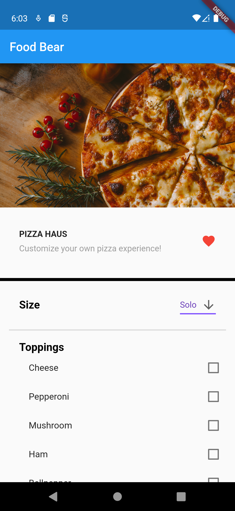
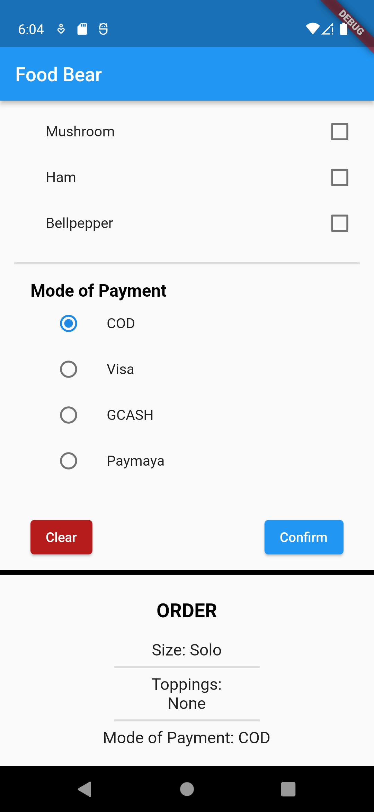
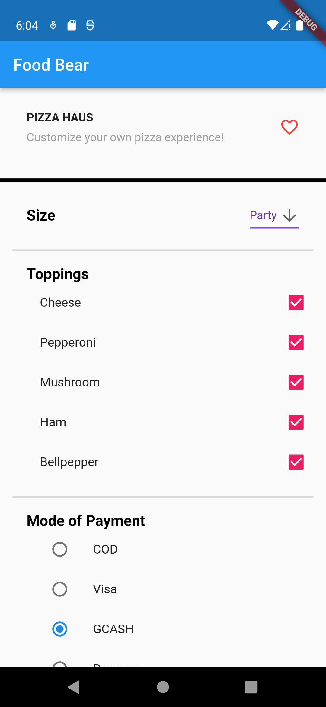
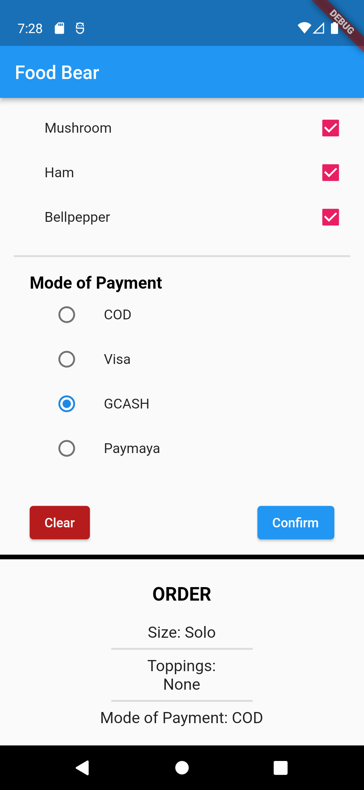

# Exercise 02 Food Bear App
### Roy Allen D. Fernandez
### 2020-00340
### WX-3L

## Exercise Description
For your 2nd exercise, you are to create a one-page mobile application that will simulate some aspects of a delivery application. This template will help you get started with your application. You can utilize the Material Components to improve the design of your output. Things you should fill out are tagged as **"TODO"**, while the tips and concepts are tagged as **"NOTE"**.

## Sample Output
- Default options
#  
- New options before confirmation
#   
- New options after confirmation
# 

## Documentation
- What was added to the code.
    - Various widgets were added to the required sections:
        1. Title Section: 
            - Text Widgets for title and description
            - Favorite Widget imported from favorite.dart
        2. Size Section:
            - Dropdown Button for choosing among the three sizes
        3. Payment Section:
            - Radio Button for choosing among the payment options
        4. Order Section:
            - Code for resetting the sections to their default values
            - Additional code for order confirmation
    - Remaining values to be displayed upon order confirmation and list of widgets for the selected toppings
    - Minor adjustments for the display

- How one was able to do the exercise.
    - Consulting Flutter's API Documentation for specific widgets (Dropdown Button, Radio Button) and relevant discussions.

- Challenges met while doing the exercise.
    - Implementing the Radio Button especially the issue of how choosing a new value only inverses the options

- Testing
    - Happy Paths encountered
        1. Click confirm button => Order section appears and display order information
        2. Click clear button => Order section disappears and options are reset to default
        3. Choose new options => Order information in the Order section is not updated until the confirm button is clicked
    - Unhappy Paths encountered
        1. Choose new payment method => Previous option set to false and the rest of the options are set to true
        2. Click confirm button => Appends a list of selected toppings, retaining previous list
        3. Click confirm button once => Change selected option from each section => Size and payment method details of the Order Section update in real-time but selected toppings are retained until the next confirmation

References:
- https://api.flutter.dev/flutter/material/Radio-class.html
- https://api.flutter.dev/flutter/material/DropdownButton-class.html
- https://stackoverflow.com/q/52052241
