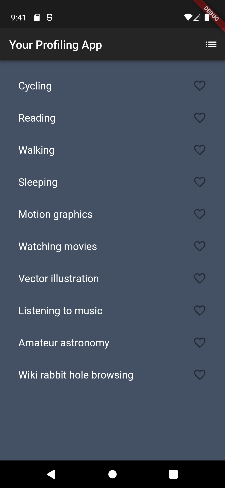
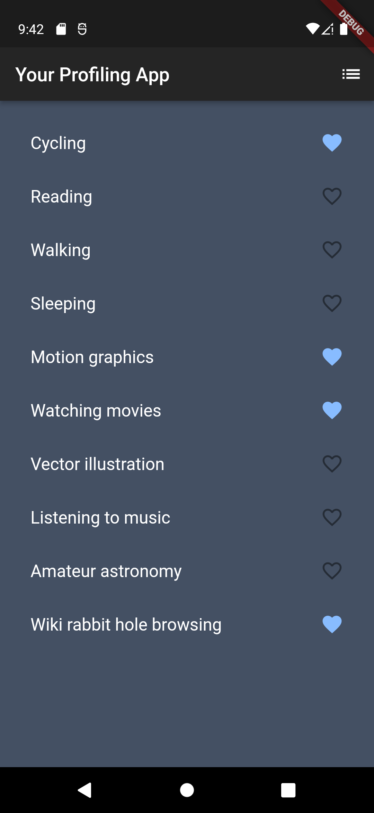
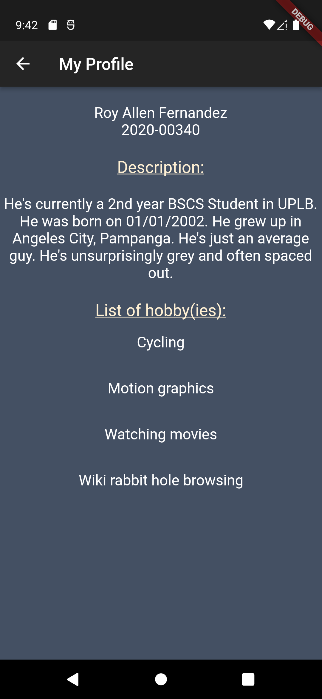
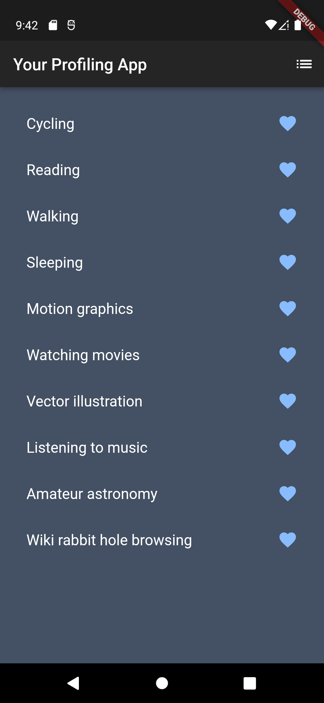
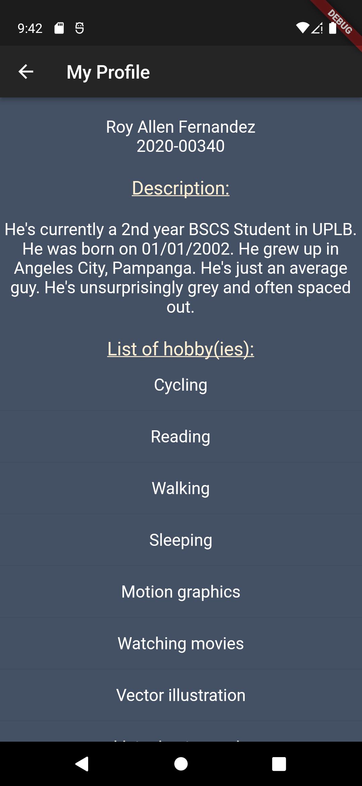
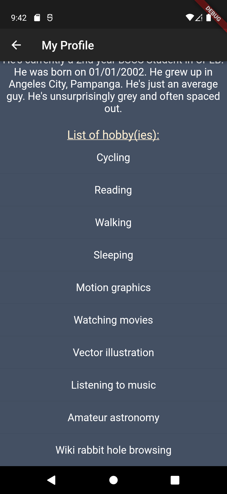

# Exercise 01 Your Profile App
### Roy Allen D. Fernandez
### 2020-00340
### CMSC 23 WX-3L

# Exercise Description
> For your exercise 1 you need to create an app named your profile app. At the start of the app, you need to select your hobbies. You are required to list at least 10 of your hobbies. Then when I click the navigation button (upper right button/icon). It will be redirected to a page. The page contacts My Profile as the header. Then it shows your name, student number, and a minimum 5 sentence description of yourself. Then all the hobbies you selected on the 1st page. The theme of your app should show your favorite colors. 

# Naming your App
```
surnameinitials_exer1_section e.g. (TANKLM_exer1_wx1).
```

# Documentation
- You must add screenshots of your work.
    - No hobbies selected
         
      
    - Some hobbies selected
        
        
    - All hobbies selected
        
        
        

- What did you add to the code.
    - 

- How are you able to do the exercise.
    - 

- Challenges met while doing the exercise.
    - Many unfamiliar terms and concepts
    - Initiall overwhelmed by the amount of content, confused by code and syntax

- Happy paths and Unhappy paths encountered.
    - Happy Paths: 
        - (Final build)
            1. No hobby selected => Empty list of hobbies
            2. All hobbies selected => Full list of hobbies
            3. 1-9 hobbies selected => 1-9 list of hobbies

    - Unhappy Paths:
        - (Build before commit 904ada9)
            1. Pressing the navigation button => App crash (Flutter Error)

:smile_cat: contact your lab instructor if you have any concerns, inquiries or problems in your exercise.
